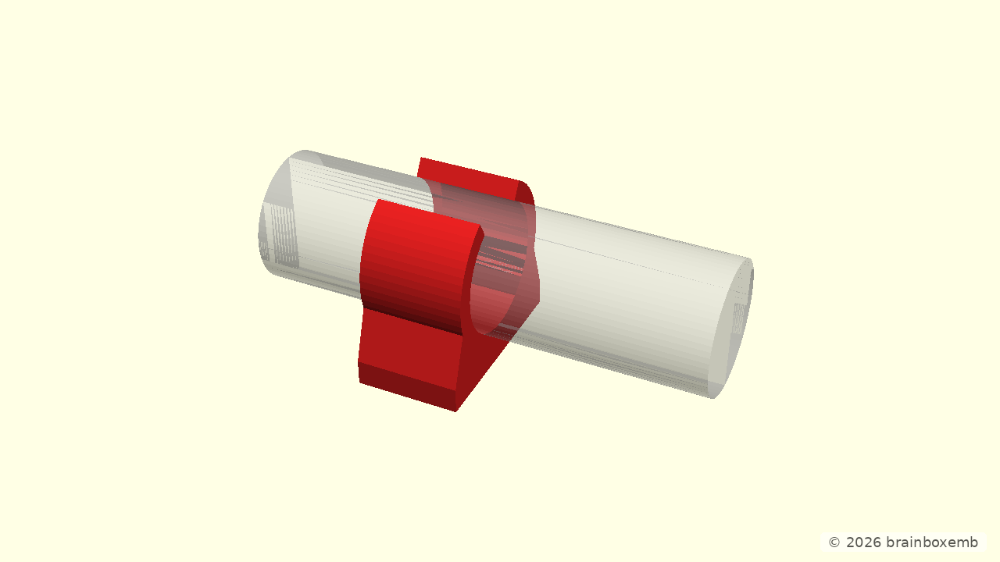
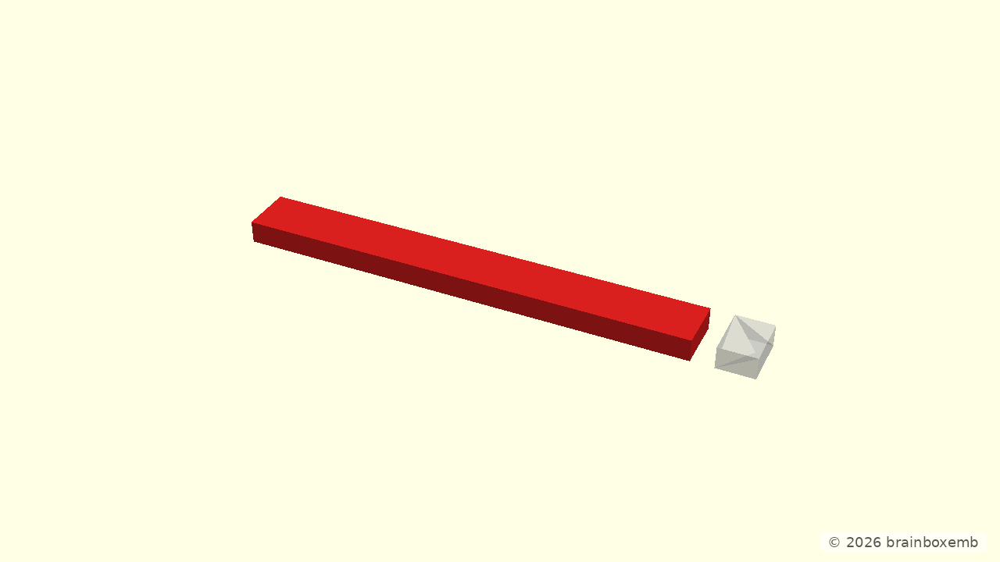

# Verification

This snapshot contains verification-specific evidence only. Normal build products remain under `bld/` and are not duplicated here.

The reference consumer currently verifies two independent OpenSCAD dependency paths:

- the configured tube holder and nominal tube bore;
- the mounting plate thickness.

These renders are verification evidence rather than presentation output, so they deliberately use the smaller verification-specific image size.

## Verification renders

The geometry above is built by the dependency-aware verification target engine. `scripts/run-verification.sh` performs the remaining cheap project-policy checks and copies this source template into the generated snapshot.

The exact source commit and runtime/tooling versions are recorded separately in `publication-info.txt` by `tool.scad-project`.
