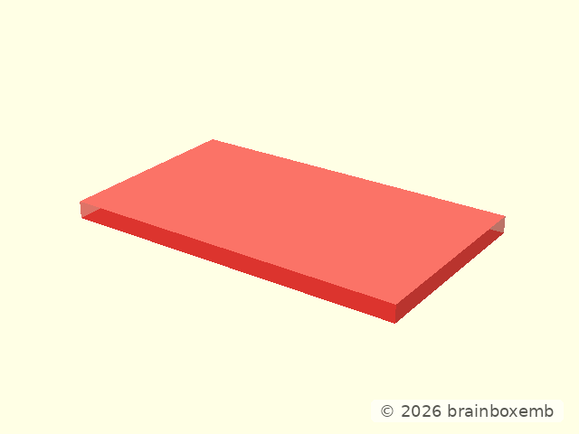
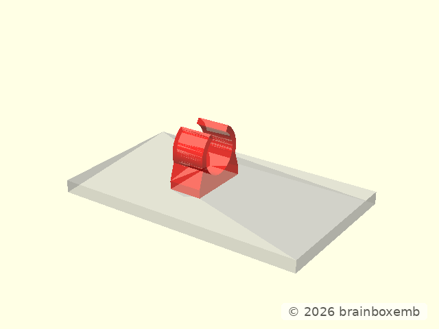
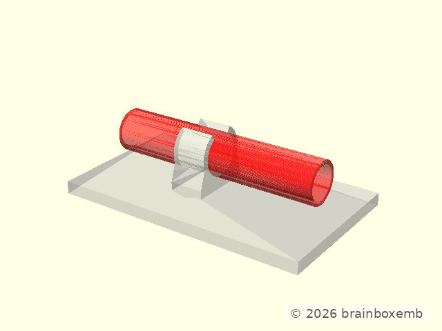
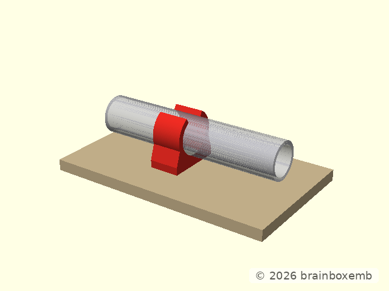

# Tube holder assembly design

The assembly combines project-specific geometry with a reusable external
library component.

## 1. Mounting plate

## 2. Add the clamp

Existing geometry is shown neutrally while the newly introduced clamp is
highlighted.

## 3. Add the horizontal reference tube

The tube follows the same X axis as the rotated clamp bore.

## 4. Final assembly

