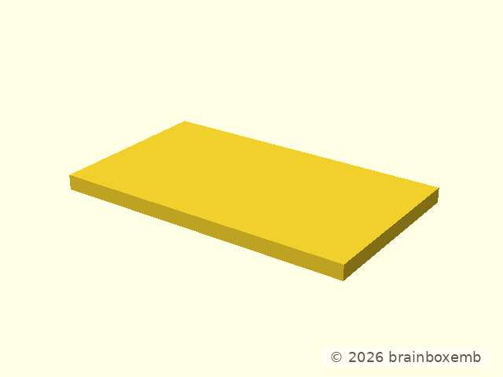

# Mounting plate design

## Purpose

The mounting plate is intentionally simple project-specific geometry. It gives
the reusable clamp a neutral mounting surface without mixing the example with a
specific real-world enclosure.

## Base plate

The plate is centered in X/Y and begins at Z=0.

## Final

The final geometry is the same simple mounting surface without the
documentation highlight.

