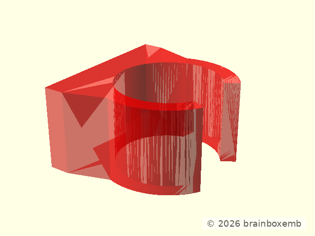
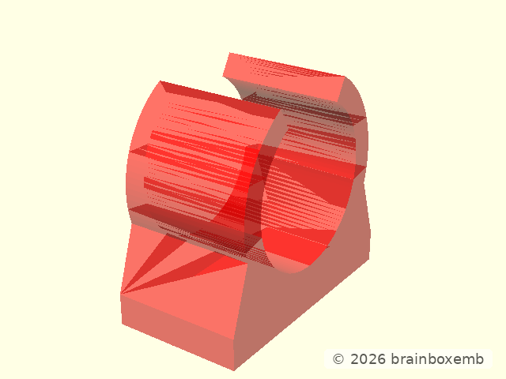
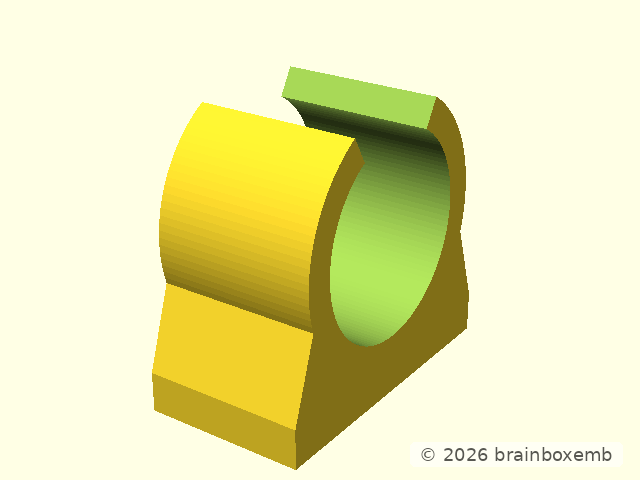

# Tube holder design

## Purpose

This component demonstrates consumption of an external reusable OpenSCAD
library without copying its implementation.

The public library API is used directly:

```scad
clamp = tube_clamp_create(
    tube_diameter = 20
);

tube_clamp_build(clamp);
```


## Library-native clamp

The library models the bore on local Z and the flat mounting face at local X=0.



## Mounted orientation

The project adapter rotates the reusable geometry so the flat face can sit on a
horizontal mounting plate and the tube axis runs horizontally along X.



## Final component


