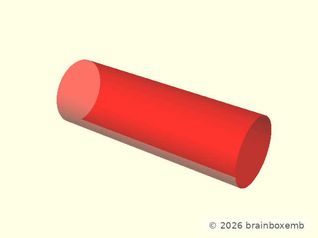
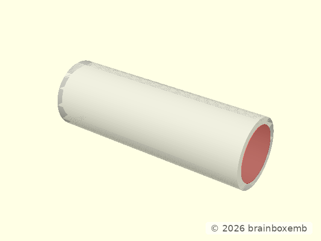
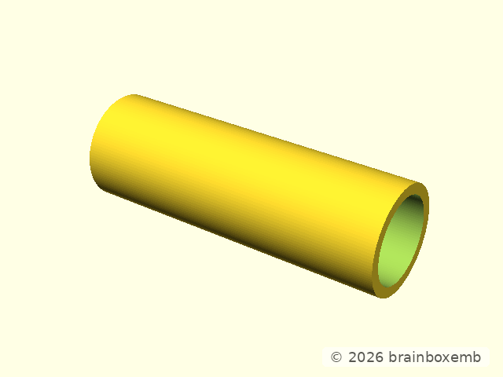
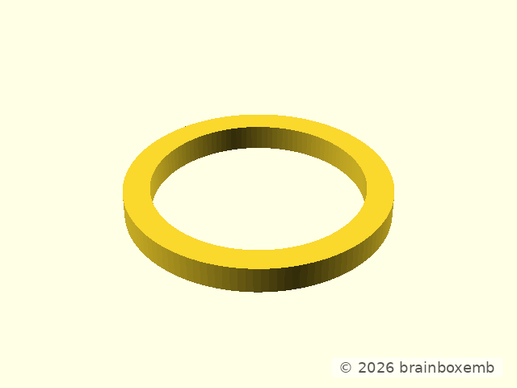

# Tube design

## Purpose

The tube is reference geometry used to demonstrate the fit between a project
assembly and the reusable clamp.

The production tube is modeled on local Z. The documentation view rotates a
shorter representative section so its length, outside diameter and bore are
easy to read.


## Outer diameter

The first design view shows the solid outside diameter.



## Bore

The second view highlights the inner bore removed from the outer solid.



## Final tube



## Wall-thickness illustration

This is a documentation-only diagram rather than reusable project geometry, so
an inline illustration is appropriate.



```openscad
linear_extrude(height=2)
difference() {
    circle(d=20);
    circle(d=16);
}
```
