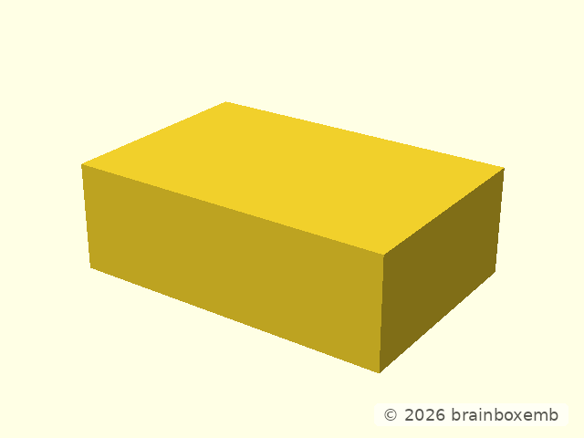
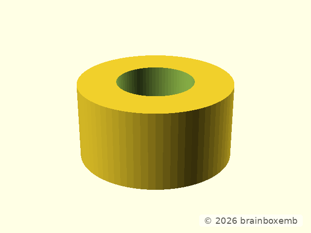

# PythonSCAD example design

## Purpose

This deliberately small component verifies that the same `design-build`
pipeline can generate documentation through the PythonSCAD backend.

## Basic block

## Bore construction

## Final PythonSCAD model

